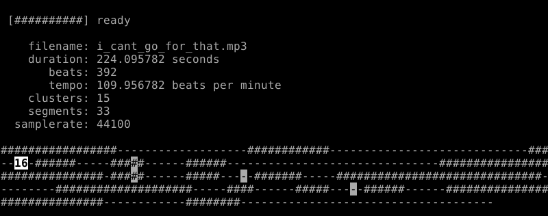
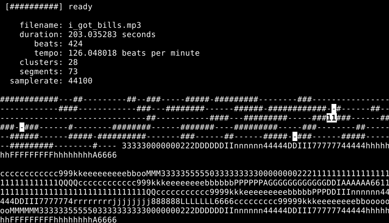

# Remixatron
(c) 2017-2021 - Dave Rensin - drensin@gmail.com  

__NOTE:__ This is a CLI. If you would prefer a GUI, please see [here](https://github.com/drensin/Remixatron/tree/master/Web%20UI). Also note that Windows users are reporting dependency problems with the CLI. If you use Windows, you should definitely use the GUI.

This program attempts to recreate the wonderful Infinite Jukebox (http://www.infinitejuke.com) on the command line in Python. It groups musically similar beats of a song into clusters and then plays a random path through the song that makes musical sense, but not does not repeat. It will do this infinitely.
***
# Demo Video
Click the image below to see a short video of the code remixing Billy Joel's _For the Longest Time_.

***
# Installation

pip install --upgrade pip  
pip install --user -r requirements.txt  
***
# Usage

    usage: infinite_jukebox.py [-h] [-clusters N] [-start start_beat]
                               [-save label] [-duration seconds] [-verbose]
                               filename

Creates an infinite remix of an audio file by finding musically similar beats and computing a randomized play path through them. The default choices should be suitable for a variety of musical styles. This work is inspired by the Infinite Jukebox (http://www.infinitejuke.com) project creaeted by Paul Lamere (paul@spotify.com)

    positional arguments:
      filename           the name of the audio file to play. Most common audio
                         types should work. (mp3, wav, ogg, etc..)

    optional arguments:
      -h, --help         show this help message and exit
      -clusters N        set the number of clusters into which we want to bucket
                         the audio. Default: 0 (automatically try to find the
                         optimal cluster value.)
      -start start_beat  start on a specific beat. Default: 1
      -save label        Save the remix to a file, rather than play it. Will
                         create file named [label].wav
      -duration seconds  length (in seconds) to save. Must use with -save.
                         Default: 180
      -verbose           print extra info about the track and play vector

**Example 1:**

Play a song infinitely.

    $ python infinite_jukebox.py i_cant_go_for_that.mp3

*Clusters* are buckets of musical similarity. Every beat belongs to exactly *one* cluster. Beats in the same cluster are musically similar -- ie. have similar pitch or timbre. When jumps are computed they always try to match clusters.

*Segments* are contiguous blocks of beats in the same cluster.

During playback the program displays a *segment map* of the song. This shows the general outline of the musical segments of the track. The bolded number is called the *position tracker*. The *location* of the tracker shows the position currently playing in the song. The *number* displayed in the tracker shows how many beats until a possible jump can occur. The highlighted characters in the segment map show the possible viable jump positions from the currently playing beat.

**Example 2:**

Play with verbose info.

    $ python infinite_jukebox.py test_audio_files/i_got_bills.mp3 -verbose

The block of information under the segment map is the *cluster map*. This is the same layout as the segment map, except that the beats have been replaced by their cluster IDs. Beats with the same cluster ID are musically similar. In the above image, for example, we can see that the position tracker rests on a beat that belongs to cluster "5". (As do all the highlighted jump candidates.)

**Example 3:**

Create a 4 minute remix named *myRemix.wav*

    $ python infinite_jukebox.py i_cant_go_for_that.mp3 -save myRemix -duration 240

    [##########] ready

       filename: i_cant_go_for_that.mp3
       duration: 00:03:44
          beats: 396
          tempo: 110 bpm
       clusters: 14
     samplerate: 44100

***

# Some notes about the code

The core work is done in the InfiniteJukebox class in the Remixatron module. *infinite_jukebox.py* is just a simple demonstration on how to use that class.

The InfiniteJukebox class can do its processing in a background thread and reports progress via the progress_callback arg. To run in a thread, pass *async=True* to the constructor. In that case, it exposes an Event named *play_ready* -- which will be signaled when the processing is complete. The default mode is to run synchronously.

Simple async example:

      def MyCallback(percentage_complete_as_float, string_message):
        print "I am now %f percent complete with message: %s" % (percentage_complete_as_float * 100, string_message)

      jukebox = InfiniteJukebox(filename='some_file.mp3', progress_callback=MyCallback, async=True)
      jukebox.play_ready.wait()

      <some work here...>

Simple Non-async example:

      def MyCallback(percentage_complete_as_float, string_message):
        print "I am now %f percent complete with message: %s" % (percentage_complete_as_float * 100, string_message)

      jukebox = InfiniteJukebox(filename='some_file.mp3', progress_callback=MyCallback, async=False)

      <blocks until completion... some work here...>

Example: Playing the first 32 beats of a song:

    from Remixatron import InfiniteJukebox
    from pygame import mixer
    import time

    jukebox = InfiniteJukebox('some_file.mp3')
    mixer.init(frequency=jukebox.sample_rate)
    channel = pygame.mixer.Channel(0)

    for beat in jukebox.beats[0:32]:
        snd = mixer.Sound(buffer=beat['buffer'])
        channel.queue(snd)
        time.sleep(beat['duration'])
