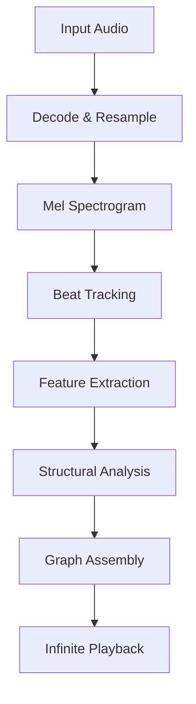

# Remixatron DSP: The Deep Dive

## Introduction
Remixatron is an audio engine designed to perform one specific magic trick: **Infinite Playback**.

It takes a finite linear audio file (like a 3-minute MP3) and transforms it into an infinite, non-repeating walk that sounds musically consistent with the original track.

This document explains the Digital Signal Processing (DSP) and Machine Learning (ML) pipeline that makes this possible. We will start with a high-level overview and then descend into the mathematical details of each stage.

### Prerequisites
This document assumes you're comfortable with:
- Basic linear algebra (vectors, matrices, dot products)
- General programming concepts
- No prior DSP or audio engineering knowledge required — we'll explain as we go!

### Further Reading (Foundational Concepts)
If you encounter unfamiliar terms, these resources will help:

| Topic | Resource |
|-------|----------|
| **Spectrograms & Mel Scale** | [Mel Spectrogram Explained](https://medium.com/analytics-vidhya/understanding-the-mel-spectrogram-fca2afa2ce53) |
| **MFCCs** | [Practical Cryptography - MFCC Tutorial](http://practicalcryptography.com/miscellaneous/machine-learning/guide-mel-frequency-cepstral-coefficients-mfccs/) |
| **Spectral Clustering** | [Von Luxburg - A Tutorial on Spectral Clustering](https://arxiv.org/abs/0711.0189) |
| **Self-Similarity Matrices** | [Müller - Music Structure Analysis (Springer)](https://www.audiolabs-erlangen.de/fau/professor/mueller/bookFMP) |
| **BeatThis Model** | [BeatThis! ISMIR 2024 Paper](https://arxiv.org/abs/2410.03438) |
| **Cosine Similarity** | [Wikipedia - Cosine Similarity](https://en.wikipedia.org/wiki/Cosine_similarity) |
| **Eigenvalues & Eigenvectors** | [3Blue1Brown - Eigenvectors Explained (Video)](https://www.youtube.com/watch?v=PFDu9oVAE-g) |

## Section 1: The "Plain English" Overview

### The Goal: Folding Time
Imagine a song as a long piece of string laid out in a straight line. Time flows from left to right. To play the song infinitely, we need to find points on that string that are "identical" enough that we can cut the string and tie it back to an earlier point without anyone noticing the knot.

We call these knots **Jumps**.

### The Challenge: "Identical" is Hard
To a computer, two parts of a song are rarely *exactly* identical.
*   The drummer might hit the snare 1 millisecond late.
*   The singer might hold a note slightly longer.
*   The recording might have slightly different noise.

If we just looked for exact matches, we would find nothing. Instead, we have to look for **Perceptual Similarity**. We need to answer the question: *"Does this beat sound like it serves the same musical purpose as that beat?"*

### The Solution: The Seven-Step Pipeline
To answer that question, Remixatron breaks the song down using a 7-step pipeline.



1.  **Decode & Resample**: We normalize the audio to a standard format (Mono, 22.05kHz) so our math works consistently on any file.
2.  **Mel Spectrogram**: We turn the audio waves into a "Heat Map" of frequencies that represents how human ears perceive sound.
3.  **Beat Tracking (AI)**: We use a Neural Network (**BeatThis**) to find exactly where every beat and bar starts. This gives us our "Grid".
4.  **Feature Extraction**: For every beat on that grid, we calculate its "Fingerprint"—a list of numbers describing its Timbre (tone color) and Pitch (harmony).
5.  **Bar Positioning**: We assign every beat a "Phase" (e.g., "Beat 1 of 4"). This ensures we don't jump from the start of a bar to the end of a bar, which would sound jarring.
6.  **Structural Analysis**: We use **Novelty Detection** to find structural boundaries (e.g., verse→chorus). Each beat is labeled with its **Segment Index** — no clustering is performed.
7.  **Graph Assembly**: Finally, we build the "Jump Graph". We connect beats that are acoustically similar and have matching Phase.

### The Result: The Infinite Walk
When you press Play, Remixatron starts walking down the string. It plays musical **phrases** (16, 32, or 64 beats) before attempting a jump.

At the end of each phrase:
- It looks for a valid Jump connection
- If found, it seamlessly transitions to a different part of the song
- If not, it extends the phrase and tries again later

Because jumps connect to beats that are **Perceptually Similar** and **Rhythmically Locked** (same bar phase), transitions are seamless.

---

## Section 2: The Pipeline (Decoding & Features)

The first step in any Music Information Retrieval (MIR) task is to get the raw data into a shape that computers can understand.

### 2.1 Decoding & Normalized Loading
> **Source**: `src-tauri/src/audio/loader.rs` (Rubato Resampling)

We support any format supported by **Symphonia** (MP3, WAV, FLAC, AAC).

However, our downstream models (BeatThis) and analysis classifiers expect a very specific input format. We cannot just feed raw 44.1kHz stereo audio.

**Normalization Specs:**
*   **Sample Rate**: `22,050 Hz` (Nyquist frequency ~11kHz, sufficient for rhythm/timbre analysis).
*   **Channels**: `Mono` (We average Left and Right channels).
*   **Resampler**: We use **Rubato** for high-quality, asynchronous resampling.

> **Why 22k?**
> Standard CD quality is 44.1kHz. We downsample to 22k to reduce the data size by half. This doubles the speed of all subsequent math operations (FFTs, Neural Nets) without losing significant musical information relevant to structure.

### 2.2 Feature Extraction (The "Fingerprint")
> **Source**: `src-tauri/src/analysis/features.rs` (feature computation / median pooling)

Once we have beats (which we'll discuss in Section 3), we need to compute the "Fingerprint" of each beat. We use two primary acoustic features:

#### A. [Mel Frequency Cepstral Coefficients (MFCC)](http://practicalcryptography.com/miscellaneous/machine-learning/guide-mel-frequency-cepstral-coefficients-mfccs/)
*   **What it measures**: **Timbre** (Texture, Color, "Sound").
*   **Dimensions**: 20 coefficients per frame.
*   **Usage**: Distinguishes between a Guitar Chord and a Synth Chord playing the same note.
*   **Math**:
    1.  Take the Log-Mel Spectrogram.
    2.  Compute the Discrete Cosine Transform (DCT).
    3.  Keep the first 20 coefficients.

#### B. [Chroma Vectors](https://en.wikipedia.org/wiki/Chroma_feature)
*   **What it measures**: **Pitch Class** (Harmony, Key).
*   **Dimensions**: 12 bins (C, C#, D, ..., B).
*   **Usage**: Identifies the chord being played.
*   **Math**:
    1.  Fold the frequency spectrum into 12 octaves.
    2.  Sum energy in each pitch class.

### 2.3 Beat Synchronization (Stacking)
Raw features are computed frame-by-frame (e.g., every 20ms). But music happens in *Beats*. A single beat might span 20 frames (400ms).

To analyze "Beat Similarity", we must aggregate these frames into a single vector per beat.

We use **Median Aggregation**:

$$
V_{beat} = median(F_{start} ... F_{end})
$$

We take the median of all MFCC/Chroma frames within the beat's duration. We use Median instead of Mean to be robust against transient noise (like a snare drum hit happening in the middle of a beat).

**Final Feature Vector ($V_{final}$):**
We concatenate the two feature sets to create a 32-dimensional vector for every beat:

$$
V_{final} = [ MFCC_{1..20} \oplus Chroma_{1..12} ]
$$

This 32-d point represents the beat in "Acoustic Space".

---

## Section 3: The Beat Tracker (BeatThis/ONNX)
Before we can extract features per beat, we need to know *where the beats are*.
We use **BeatThis** (ISMIR 2024), a State-of-the-Art beat tracking neural network.

### 3.1 The Model Architecture
BeatThis is a modern neural network optimized for beat and downbeat detection.
*   **Input**: The Mel Spectrogram.
*   **Layers**:
    *   **Convolutional Blocks**: To extract local spectral features.
    *   **TCN (Temporal Convolutional Network)**: To model long-range rhythmic dependencies (e.g., measuring the distance between kicks).
    *   **Output Layer**: Two heads.
        1.  **Beat Activation**: "Is this frame a beat?" (Probability 0..1)
        2.  **Downbeat Activation**: "Is this frame the start of a bar?" (Probability 0..1)

### 3.2 Inference (ONNX)
> **Source**: `src-tauri/src/beat_tracker/inference.rs`

We run the model using **ONNX Runtime**. This allows us to use the exact same weights as the original Python research code but executed in highly optimized C++/Rust.

```rust
// src-tauri/src/beat_tracker/inference.rs
let session = Session::builder()?.with_optimization_level(GraphOptimizationLevel::Level3)?.with_intra_threads(1)?.with_model_from_file(path)?;
```

### 3.3 Post-Processing (Peak Picking)
> **Source**: `src-tauri/src/beat_tracker/post_processor.rs` (`MinimalPostProcessor`)

The raw output of the Neural Net is a stream of probabilities (Logits).
While many systems use complex Hidden Markov Models (HMM) or Dynamic Bayesian Networks (DBN) to decode these probabilities, **BeatThis** is robust enough that we can use a simpler, faster approach: **Peak Picking**.

We implement a `MinimalPostProcessor` which:
1.  **Thresholds**: Ignores any frame with probability < 0.5.
2.  **Max Pools**: Looks for local maxima within a 7-frame window (+/- 60ms).
3.  **Aligns**: Snaps "Downbeats" to the nearest detected "Beat" to ensure grid consistency.

**The Result**:
A vector of clean timestamps:
*   `Beats: [0.55s, 1.05s, 1.55s...]`
*   `Downbeats: [0.55s, 2.55s...]` (Subset of beats)

This "Grid" gives us the time boundaries we used in Section 2.3 to aggregate features.

---

## Section 4: Hybrid Segmentation (Novelty-Based)

This is the mathematical core of Remixatron. The goal is to:
1. Find **Segment Boundaries** (where does the song transition?)
2. Assign each beat a **Segment Label** (its segment index)

> **Note**: Previous versions used spectral clustering to group similar segments.
> This was removed because it often collapsed distinct sections, reducing structural variety.
> Now each segment detected by novelty peaks is treated as its own unique label.

We use **Novelty Detection** on a Self-Similarity Matrix:
- **Novelty Detection**: Excels at finding boundaries (structural transitions)
- **Segment Index = Label**: No clustering — each segment is unique

### 4.1 Self-Similarity Matrix (SSM)
> **Source**: `src-tauri/src/analysis/structure.rs` (`compute_segments_checkerboard`)

First, we build a matrix showing how similar each beat is to every other beat:

$$
SSM[i, j] = \frac{A_i \cdot A_j}{||A_i|| \times ||A_j||}
$$

Where $A_i$ is the combined MFCC+Chroma feature vector for beat $i$.

The SSM reveals the "block structure" of the song. Repeated sections (verses, choruses) appear as bright squares along the diagonal.

### 4.2 Checkerboard Novelty Detection
> **Source**: `src-tauri/src/analysis/structure.rs` (`compute_novelty_curve`)

To find where sections change, we convolve a **Checkerboard Kernel** along the SSM diagonal:

$$
K = \begin{bmatrix} +1 & -1 \\ -1 & +1 \end{bmatrix}
$$

This kernel responds strongly at points where the music changes (e.g., verse → chorus), producing a **Novelty Curve**. Peaks in this curve indicate structural boundaries.

**Peak Detection Parameters:**
- `window = 16` — Local maxima radius
- `alpha = 1.25` — Peak must be 25% above local mean
- `min_dist = 16` — Minimum 16 beats between boundaries

### 4.3 Downbeat Snapping

Raw novelty peaks rarely land exactly on musical boundaries. We **snap** each peak to the nearest downbeat (bar start) to ensure segments align with the musical grid.

### 4.4 Segment Labeling (No Clustering)

> **Previous behavior** (now disabled): The code computed a recurrence-based affinity matrix
> and used spectral clustering to group similar segments (e.g., Verse 1 = Verse 2).
> 
> **Current behavior**: Each segment gets its own unique label (segment index).
> This preserves all structural granularity from novelty detection.

Jump quality is determined by **beat-level similarity** (Section 6), not segment labels.
The "different segment" rule (Section 6.3) prevents micro-loops.

### ~~4.5 Spectral Clustering on Segments~~ (Disabled)

> This section describes **legacy behavior**. Spectral clustering is currently disabled.
> It was found to collapse distinct sections on homogeneous productions, reducing variety.

The affinity matrix computation and spectral embedding code remain in `structure.rs` but
are bypassed by the current pipeline.

---

## ~~Section 5: The "Auto-K" Selection Algorithm~~ (Disabled)

> **This entire section describes legacy behavior.**
> K selection is no longer performed because clustering is disabled.

With clustering disabled, K = n_segments (each segment is its own cluster).
The silhouette scores, ratio metrics, and eigengap heuristics are no longer used.

---


<details>
<summary><strong>Section 5 (Legacy): The Auto-K Selection Algorithm</strong> — Click to expand</summary>

> ⚠️ **This section describes disabled legacy behavior.**
> With clustering disabled, K = n_segments and this selection logic is bypassed.

One critical question remains: **How many clusters ($k$) should we use?**
If $k=1$, the whole song is one blob.
If $k=100$, every beat is its own cluster.

We need a "Goldilocks" number. To find it, we don't just guess. we iterate through a range of $k = 3 \text{ to } 32$ and score each one using a custom Fitness Function.

### 5.1 The Silhouette Score
> **Source**: `src-tauri/src/analysis/structure.rs` (`calculate_silhouette_score`)

For a given clustering, the Silhouette Score ($S$) measures how well-separated the clusters are.
$$
s(i) = \frac{b(i) - a(i)}{\max(a(i), b(i))}
$$

*   $a(i)$: Average distance to other points in the *same* cluster (Cohesion).
*   $b(i)$: Average distance to points in the *nearest neighbor* cluster (Separation).

$S$ ranges from -1 to +1. High values mean distinct, well-separated clusters.

### 5.2 The "Connectivity" Metric (Median Jumps)
Silhouette score alone isn't enough. It might find perfect mathematical clusters that have no musical relation to each other (e.g., grouping all silent parts).
For the Infinite Jukebox to work, we need **Options**. We want a graph where the average beat has many valid paths to jump to.

We simulate the jump graph for each $k$ and calculate the **Median Jump Count**—the number of valid jumps available to the "typical" beat.

### 5.3 The Default Strategy: Normalized Eigengap
> **Source**: `src-tauri/src/analysis/structure.rs` (`AutoKStrategy::EigengapHeuristic`)

The default strategy is the **Normalized Eigengap Heuristic** from Von Luxburg's "Tutorial on Spectral Clustering":

$$
K^* = \arg\max_k \frac{\lambda_{k+1} - \lambda_k}{\lambda_k}
$$

This selects $K$ where the *relative* eigenvalue gap is largest. Normalizing by $\lambda_k$ naturally prefers proportionally significant gaps without requiring arbitrary caps.

**Alternative Strategies** (available for experimentation):
- **BalancedConnectivity**: `(100 × Silhouette) + Median(Jumps)`
- **ConnectivityFirst**: Maximize escape fraction above quality floors
- **MaxK**: Maximize K subject to quality/connectivity floors

</details>

---

## Section 6: Jump Logic & Graph Generation

Once we have Features, a Grid, and Cluster Labels, we can finally build the **Jump Graph**.

### 6.0 Jump Candidate Generation (Adaptive P75 Threshold)
> **Source**: `src-tauri/src/analysis/structure.rs` (`compute_jump_graph`)

Before filtering, we build the initial jump graph using an **adaptive threshold**.

1. For each beat, find the k=10 nearest neighbors by cosine similarity
2. Exclude immediate neighbors (within 4 beats) to avoid stutter jumps
3. Collect all similarity scores across the entire song
4. Compute the **P75 percentile** as the adaptive threshold
5. Keep only edges with similarity ≥ P75 (~25% of candidates)

This adaptive approach ensures each song gets an appropriate threshold based on its own similarity distribution. Songs with naturally high self-similarity get a higher threshold; songs with more variation get a lower one.

### Decision-Time Filtering (2-Step Check)

At playback graph construction time, we apply additional musical constraints:

### 6.1 Look-Ahead Matching
> **Source**: `src-tauri/src/workflow.rs` (Line ~219 "Loop Look Ahead")

The most common mistake in audio looping is matching the *current* sound.
If we match Beat A to Beat B because they both sound like a snare drum, the jump might land us in a completely different rhythm.

Instead, we look at the **Next Beat**.
> "If I am at Beat A, and I am about to play Beat A+1... does Beat B+1 sound like Beat A+1?"

We want to ensure the **Destination** flows naturally from the **Source**.

### 6.2 Phase Locking (The "Bar" Rule)
> **Source**: `src-tauri/src/workflow.rs` (Line ~236-244 "Phase Consistency")

Music is cyclical. Beats have a fixed position within a bar (e.g., 1, 2, 3, 4).
To accept a jump, we must maintain the continuity of this cycle.

If we just played **Beat 4** (End of Bar), the listener expects **Beat 1** (Start of Next Bar).
*   **Correct**: Jumping from Beat 4 to a different Beat 1. This preserves the flow.
*   **Incorrect**: Jumping from Beat 4 to Beat 3 (Time Travel) or another Beat 4 (Stutter).

**Rule**: We enforce that the Jump Target must have the same `bar_position` as the beat we *would have played* linearly.

$$
\text{Phase}(\text{Target}) \equiv \text{Phase}(\text{Next Linear Beat})
$$

### 6.3 Minimum Distance
> **Source**: `src-tauri/src/workflow.rs` (Line ~256 "Minimum Distance")

To prevent jarring micro-jumps (e.g., jumping just 2-3 beats away), we require a minimum spatial separation between source and target beats.

**Rule**: Jump targets must be at least **8 beats away** from the source:

$$
|\text{Target} - \text{Source}| \geq 8
$$

This ensures jumps feel intentional and move to meaningfully different parts of the song structure.

> **Note**: The segment diversity check (preventing jumps within the same segment) was **removed**.
> Recency-based scoring in the playback engine (Section 7.2) now handles micro-loop prevention
> more effectively by tracking individual beat playback history.


### The Graph
The result of this process is a directed graph where every beat has:
1.  **One Primary Edge**: The next beat (Linear playback).
2.  **Zero or More Jump Edges**: "Portals" to other parts of the song.

This graph is what gets serialized and sent to the playback engine.

---

## Section 7: Real-Time Decision Making

Unlike V1 (Python), which pre-calculated a single path, Remixatron V3 makes decisions **Just-In-Time (JIT)**.

The `PlaybackEngine` runs a high-priority thread that wakes up every time a beat finishes playing. It asks a simple question:

> *"Where do we go next?"*

### 7.1 The Sequence Engine
> **Source**: `src-tauri/src/playback_engine.rs` (`get_next_beat`, `PlayInstruction`)

Remixatron V3 abandoned the "weighted dice" approach of previous versions. Probability rolls often led to jittery, chaotic behavior where the music would jump too frequently.

Instead, we use a **Structured Sequence Engine**:
1.  **Pick a Target Length**: When a jump lands, the engine picks a random "Safe Length" from a musical grid (e.g., 16, 32, 64 beats).
2.  **Play Linearly**: It forces linear playback for that duration.
3.  **Attempt Jump**: Once the sequence is complete, it *guarantees* a jump attempt at the next available opportunity.

This creates meaningful "Phrases" of music rather than random stuttering.

### 7.2 Recency-Based Jump Selection
> **Source**: `src-tauri/src/playback_engine.rs` (`get_next_beat`, Line ~619)

Instead of tracking segment history, Remixatron V3 uses a **FIFO play history queue** to prevent micro-loops:

1. **Track Every Beat**: A queue of size = song length tracks every beat played (oldest at front, newest at back)
2. **Score by Recency**: Candidates are scored based on their **most recent** position in the queue:
   ```rust
   recency_score = if let Some(pos) = play_history.rposition(|&id| id == candidate_id) {
       song_length - pos  // Older (low pos) = high score
   } else {
       song_length  // Never played = maximum score
   }
   ```
3. **Filter by Threshold**: Candidates scoring below **25% of song length** are filtered out
4. **Distance Tiebreaker**: When recency scores tie, prefer more distant candidates

**Dynamic Panic Threshold**:

The system detects when it's stuck playing linearly too long. The panic threshold scales with graph density:

$$
\text{threshold} = \text{song\\_length} \times 0.10 \times \frac{2.5}{\text{avg\\_candidates}}
$$

- **Sparse graphs** (avg=1.7 candidates/beat) → **higher threshold** (~15% of song) → gives recency filter more time
- **Dense graphs** (avg=2.5 candidates/beat) → **baseline threshold** (~10% of song)
- When panic mode triggers, the recency filter is bypassed to ensure forward progress

This replaces the legacy "segment history" and "quartile busting" systems with a simpler, more effective approach.

### Conclusion
This combination of **Deep Spectral Analysis** (to find the structure) and **Real-Time Probabilistic Logic** (to navigate it) is what allows Remixatron to create an infinite, non-repeating, and musically coherent experience.


