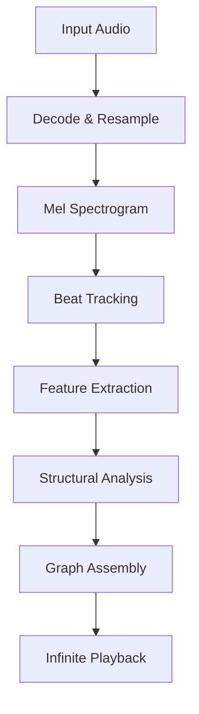

# Remixatron DSP: The Deep Dive

## Introduction
Remixatron is an audio engine designed to perform one specific magic trick: **Infinite Playback**.

It takes a finite linear audio file (like a 3-minute MP3) and transforms it into an infinite, non-repeating walk that sounds musically consistent with the original track.

This document explains the Digital Signal Processing (DSP) and Machine Learning (ML) pipeline that makes this possible. We will start with a high-level overview and then descend into the mathematical details of each stage.

## Section 1: The "Plain English" Overview

### The Goal: Folding Time
Imagine a song as a long piece of string laid out in a straight line. Time flows from left to right. To play the song infinitely, we need to find points on that string that are "identical" enough that we can cut the string and tie it back to an earlier point without anyone noticing the knot.

We call these knots **Jumps**.

### The Challenge: "Identical" is Hard
To a computer, two parts of a song are rarely *exactly* identical.
*   The drummer might hit the snare 1 millisecond late.
*   The singer might hold a note slightly longer.
*   The recording might have slightly different noise.

If we just looked for exact matches, we would find nothing. Instead, we have to look for **Perceptual Similarity**. We need to answer the question: *"Does this beat sound like it serves the same musical purpose as that beat?"*

### The Solution: The Seven-Step Pipeline
To answer that question, Remixatron breaks the song down using a 7-step pipeline.



1.  **Decode & Resample**: We normalize the audio to a standard format (Mono, 22.05kHz) so our math works consistently on any file.
2.  **Mel Spectrogram**: We turn the audio waves into a "Heat Map" of frequencies that represents how human ears perceive sound.
3.  **Beat Tracking (AI)**: We use a Neural Network (**BeatNet**) to find exactly where every beat and bar starts. This gives us our "Grid".
4.  **Feature Extraction**: For every beat on that grid, we calculate its "Fingerprint"—a list of numbers describing its Timbre (tone color) and Pitch (harmony).
5.  **Bar Positioning**: We assign every beat a "Phase" (e.g., "Beat 1 of 4"). This ensures we don't jump from the start of a bar to the end of a bar, which would sound jarring.
6.  **Structural Analysis**: We look at all the fingerprints at once to find the "Shape" of the song. We group similar beats into **Clusters** (e.g., "Verse Beats", "Chorus Beats").
7.  **Graph Assembly**: Finally, we build the "Jump Graph". We connect beats that share the same Cluster and Phase.

### The Result: The Infinite Walk
When you press Play, Remixatron starts walking down the string. Every time it hits a beat with a valid "Jump Connection", it rolls a weighted dice.

*   **90% of the time**: It keeps playing the next linear beat (Normal playback).
*   **10% of the time**: It takes the Jump to a different part of the song.

Because the Jump connects to a beat that is **Perceptually Similar** (same Cluster) and **Rythmically Locked** (same Phase), the transition is seamless.

---

## Section 2: The Pipeline (Decoding & Features)

The first step in any Music Information Retrieval (MIR) task is to get the raw data into a shape that computers can understand.

### 2.1 Decoding & Normalized Loading
> **Source**: `src-tauri/src/audio/loader.rs` (Rubato Resampling)

We support any format supported by **Symphonia** (MP3, WAV, FLAC, AAC).

However, our downstream models (BeatNet) and analysis classifiers expect a very specific input format. We cannot just feed raw 44.1kHz stereo audio.

**Normalization Specs:**
*   **Sample Rate**: `22,050 Hz` (Nyquist frequency ~11kHz, sufficient for rhythm/timbre analysis).
*   **Channels**: `Mono` (We average Left and Right channels).
*   **Resampler**: We use **Rubato** for high-quality, asynchronous resampling.

> **Why 22k?**
> Standard CD quality is 44.1kHz. We downsample to 22k to reduce the data size by half. This doubles the speed of all subsequent math operations (FFTs, Neural Nets) without losing significant musical information relevant to structure.

### 2.2 Feature Extraction (The "Fingerprint")
> **Source**: `src-tauri/src/analysis/features.rs` (feature computation / median pooling)

Once we have beats (which we'll discuss in Section 3), we need to compute the "Fingerprint" of each beat. We use two primary acoustic features:

#### A. Mel Frequency Cepstral Coefficients (MFCC)
*   **What it measures**: **Timbre** (Texture, Color, "Sound").
*   **Dimensions**: 20 coefficients per frame.
*   **Usage**: Distinguishes between a Guitar Chord and a Synth Chord playing the same note.
*   **Math**:
    1.  Take the Log-Mel Spectrogram.
    2.  Compute the Discrete Cosine Transform (DCT).
    3.  Keep the first 20 coefficients.

#### B. Chroma Vectors
*   **What it measures**: **Pitch Class** (Harmony, Key).
*   **Dimensions**: 12 bins (C, C#, D, ..., B).
*   **Usage**: Identifies the chord being played.
*   **Math**:
    1.  Fold the frequency spectrum into 12 octaves.
    2.  Sum energy in each pitch class.

### 2.3 Beat Synchronization (Stacking)
Raw features are computed frame-by-frame (e.g., every 20ms). But music happens in *Beats*. A single beat might span 20 frames (400ms).

To analyze "Beat Similarity", we must aggregate these frames into a single vector per beat.

We use **Median Aggregation**:
$$
V_{beat} = median(F_{start} ... F_{end})
$$
We take the median of all MFCC/Chroma frames within the beat's duration. We use Median instead of Mean to be robust against transient noise (like a snare drum hit happening in the middle of a beat).

**Final Feature Vector ($V_{final}$):**
We concatenate the two feature sets to create a 32-dimensional vector for every beat:
$$
V_{final} = [ MFCC_{1..20} \oplus Chroma_{1..12} ]
$$
This 32-d point represents the beat in "Acoustic Space".

---

## Section 3: The Beat Tracker (BeatNet/ONNX)
Before we can extract features per beat, we need to know *where the beats are*.
We use **BeatNet**, a State-of-the-Art Particle Filtering Neural Network.

### 3.1 The Model Architecture
BeatNet is a Convolutional Recurrent Neural Network (CRNN).
*   **Input**: The Mel Spectrogram.
*   **Layers**:
    *   **Convolutional Blocks**: To extract local spectral features.
    *   **TCN (Temporal Convolutional Network)**: To model long-range rhythmic dependencies (e.g., measuring the distance between kicks).
    *   **Output Layer**: Two heads.
        1.  **Beat Activation**: "Is this frame a beat?" (Probability 0..1)
        2.  **Downbeat Activation**: "Is this frame the start of a bar?" (Probability 0..1)

### 3.2 Inference (ONNX)
> **Source**: `src-tauri/src/beat_tracker/inference.rs`

We run the model using **ONNX Runtime**. This allows us to use the exact same weights as the original Python research code but executed in highly optimized C++/Rust.

```rust
// src-tauri/src/beat_tracker/inference.rs
let session = Session::builder()?.with_optimization_level(GraphOptimizationLevel::Level3)?.with_intra_threads(1)?.with_model_from_file(path)?;
```

### 3.3 Post-Processing (Peak Picking)
> **Source**: `src-tauri/src/beat_tracker/post_processor.rs` (`MinimalPostProcessor`)

The raw output of the Neural Net is a stream of probabilities (Logits).
While many systems use complex Hidden Markov Models (HMM) or Dynamic Bayesian Networks (DBN) to decode these probabilities, **BeatNet** is robust enough that we can use a simpler, faster approach: **Peak Picking**.

We implement a `MinimalPostProcessor` which:
1.  **Thresholds**: Ignores any frame with probability < 0.5.
2.  **Max Pools**: Looks for local maxima within a 7-frame window (+/- 60ms).
3.  **Aligns**: Snaps "Downbeats" to the nearest detected "Beat" to ensure grid consistency.

**The Result**:
A vector of clean timestamps:
*   `Beats: [0.55s, 1.05s, 1.55s...]`
*   `Downbeats: [0.55s, 2.55s...]` (Subset of beats)

This "Grid" gives us the time boundaries we used in Section 2.3 to aggregate features.

---

## Section 4: Spectral Clustering & Segmentation

This is the mathematical core of Remixatron. The goal is to group all the beats in the song into **Perceptual Clusters**.
*   **Cluster 0**: Verse Beats.
*   **Cluster 1**: Chorus Beats.
*   **Cluster 2**: Bridge Beats.

We use **Laplacian Spectral Clustering**, a powerful technique from Graph Theory that groups points based on connectivity rather than just Euclidean distance.

### 4.1 The Affinity Matrix (Search Graph)
> **Source**: `src-tauri/src/analysis/structure.rs` (`compute_jump_graph`)

Instead of a dense matrix (checking every beat against every other beat), we build a **Sparse k-Nearest Neighbor Graph**.
For every beat, we find the 10 most similar other beats in the song using **Cosine Similarity**:

$$
\text{Sim}(A, B) = \frac{A \cdot B}{||A|| \times ||B||}
$$

We only keep edges where Similarity > 0.35. This creates a graph where connected nodes are perceptually similar.

### 4.2 The Graph Laplacian (L)
We treat the song as a Graph where each beat is a node and $R_{ij}$ is the weight of the edge connecting them.
We compute the **Normalized Laplacian**:

$$
L = I - D^{-1/2} R D^{-1/2}
$$

*   $I$: Identity Matrix.
*   $D$: Degree Matrix (Diagonal matrix where $D_{ii} = \sum_j R_{ij}$).

### 4.3 Eigendecomposition (The Magic)
> **Source**: `src-tauri/src/analysis/structure.rs` (`jacobi_eigenvalue`)

We solve for the eigenvectors and eigenvalues of $L$.

$$
L v = \lambda v
$$

The eigenvectors corresponding to the $k$ smallest eigenvalues contain the "Embedding" of the song structure.
Instead of clustering the raw 32-d features (which are noisy), we cluster these eigenvectors. This transforms the problem from "grouping similar sounds" to "grouping connected components in the graph".

### 4.4 K-Means on Eigenvectors
> **Source**: `src-tauri/src/analysis/structure.rs` (`compute_segments_knn`)

Finally, we run standard **K-Means Clustering** on the first $k$ eigenvectors.
This assigns a Label (0..k) to every beat.

**The Result**:
```
Beats:  [0, 1, 2, 3, 4, 5, 6, 7...]
Labels: [A, A, A, A, B, B, A, A...]
```
*   Beats 0-3 are Segment 1 (Label A).
*   Beats 4-5 are Segment 2 (Label B).
*   Beats 6-7 are Segment 3 (Label A).

This reveals the "Verse -> Chorus -> Verse" structure.

---

## Section 5: The "Auto-K" Selection Algorithm

One critical question remains: **How many clusters ($k$) should we use?**
If $k=1$, the whole song is one blob.
If $k=100$, every beat is its own cluster.

We need a "Goldilocks" number. To find it, we don't just guess. we iterate through a range of $k = 3 \text{ to } 32$ and score each one using a custom Fitness Function.

### 5.1 The Silhouette Score
> **Source**: `src-tauri/src/analysis/structure.rs` (`calculate_silhouette_score`)

For a given clustering, the Silhouette Score ($S$) measures how well-separated the clusters are.
$$
s(i) = \frac{b(i) - a(i)}{\max(a(i), b(i))}
$$
*   $a(i)$: Average distance to other points in the *same* cluster (Cohesion).
*   $b(i)$: Average distance to points in the *nearest neighbor* cluster (Separation).

$S$ ranges from -1 to +1. High values mean distinct, well-separated clusters.

### 5.2 The "Connectivity" Metric (Median Jumps)
Silhouette score alone isn't enough. It might find perfect mathematical clusters that have no musical relation to each other (e.g., grouping all silent parts).
For the Infinite Jukebox to work, we need **Options**. We want a graph where the average beat has many valid paths to jump to.

We simulate the jump graph for each $k$ and calculate the **Median Jump Count**—the number of valid jumps available to the "typical" beat.

### 5.3 The Fitness Function (Balanced Connectivity)
> **Source**: `src-tauri/src/analysis/structure.rs` (`AutoKStrategy::BalancedConnectivity`)

We use the **Balanced Connectivity** heuristic (found in `structure.rs`):

$$
Score_k = (100 \times S_{avg}) + \text{Median}(Jumps)
$$

*   **$100 \times S_{avg}$**: Heavily weights Cluster Purity (Do these beats sound the same?).
*   **Median(Jumps)**: Rewards graphs that are "Dense" and playable.

We calculate this score for $k=3..32$ and pick the winner. This ensures we select a complexity level that produces a rich, interconnected remix graph.

---

## Section 6: Jump Logic & Graph Generation

Once we have Features, a Grid, and Cluster Labels, we can finally build the **Jump Graph**.

To decide if Beat A can jump to Beat B, we perform a strict 3-step check.

### 6.1 Look-Ahead Matching
> **Source**: `src-tauri/src/workflow.rs` (Line ~219 "Loop Look Ahead")

The most common mistake in audio looping is matching the *current* sound.
If we match Beat A to Beat B because they both sound like a snare drum, the jump might land us in a completely different rhythm.

Instead, we look at the **Next Beat**.
> "If I am at Beat A, and I am about to play Beat A+1... does Beat B+1 sound like Beat A+1?"

We want to ensure the **Destination** flows naturally from the **Source**.

### 6.2 Phase Locking (The "Bar" Rule)
> **Source**: `src-tauri/src/workflow.rs` (Line ~236-244 "Phase Consistency")

Music is cyclical. Beats have a fixed position within a bar (e.g., 1, 2, 3, 4).
To accept a jump, we must maintain the continuity of this cycle.

If we just played **Beat 4** (End of Bar), the listener expects **Beat 1** (Start of Next Bar).
*   **Correct**: Jumping from Beat 4 to a different Beat 1. This preserves the flow.
*   **Incorrect**: Jumping from Beat 4 to Beat 3 (Time Travel) or another Beat 4 (Stutter).

**Rule**: We enforce that the Jump Target must have the same `bar_position` as the beat we *would have played* linearly.

$$
\text{Phase}(\text{Target}) \equiv \text{Phase}(\text{Next Linear Beat})
$$

### 6.3 Segment Diversity
> **Source**: `src-tauri/src/workflow.rs` (Line ~247 "Structural Diversity")

We generally want to jump to a *structurally identical* part of the song, but in a *different* time period.
*   **Good**: Jumping from "Verse 1" to "Verse 2".
*   **Bad**: Jumping from "Verse 1" back to itself (Micro-looping).

We prevent micro-loops by enforcing that `Segment(Target) != Segment(Source)` whenever possible.

### The Graph
The result of this process is a directed graph where every beat has:
1.  **One Primary Edge**: The next beat (Linear playback).
2.  **Zero or More Jump Edges**: "Portals" to other parts of the song.

This graph is what gets serialized and sent to the playback engine.

---

## Section 7: Real-Time Decision Making

Unlike V1 (Python), which pre-calculated a single path, Remixatron V3 makes decisions **Just-In-Time (JIT)**.

The `PlaybackEngine` runs a high-priority thread that wakes up every time a beat finishes playing. It asks a simple question:

> *"Where do we go next?"*

### 7.1 The Sequence Engine
> **Source**: `src-tauri/src/playback_engine.rs` (`get_next_beat`, `PlayInstruction`)

Remixatron V3 abandoned the "weighted dice" approach of previous versions. Probability rolls often led to jittery, chaotic behavior where the music would jump too frequently.

Instead, we use a **Structured Sequence Engine**:
1.  **Pick a Target Length**: When a jump lands, the engine picks a random "Safe Length" from a musical grid (e.g., 16, 32, 64 beats).
2.  **Play Linearly**: It forces linear playback for that duration.
3.  **Attempt Jump**: Once the sequence is complete, it *guarantees* a jump attempt at the next available opportunity.

This creates meaningful "Phrases" of music rather than random stuttering.

### 7.2 Safety Systems
> **Source**: `src-tauri/src/playback_engine.rs` (Line ~442 "Recent Segments")

To prevent getting stuck, we maintain a **History Buffer**:
*   **Recent Segments**: We track the last `25%` of unique segments visited.
*   **The Rule**: You cannot jump to a segment currently in the History Buffer.
    *   This forces the walker to explore the *entire* song structure before returning to a previous chorus.

**Quartile Busting**:
If the engine fails to find a valid jump for too long (e.g., > 10% of the song), it enters "Panic Mode" and intentionally targets a beat in a different 25% (Quartile) of the song to force a scene change.

### Conclusion
This combination of **Deep Spectral Analysis** (to find the structure) and **Real-Time Probabilistic Logic** (to navigate it) is what allows Remixatron to create an infinite, non-repeating, and musically coherent experience.


